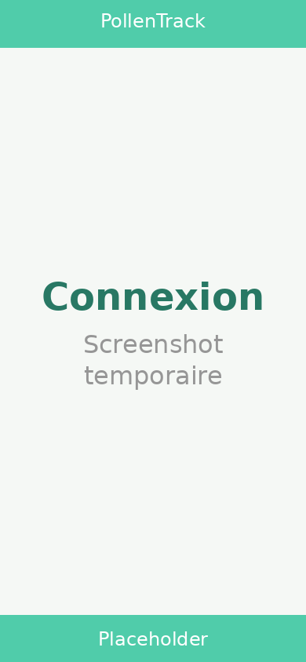
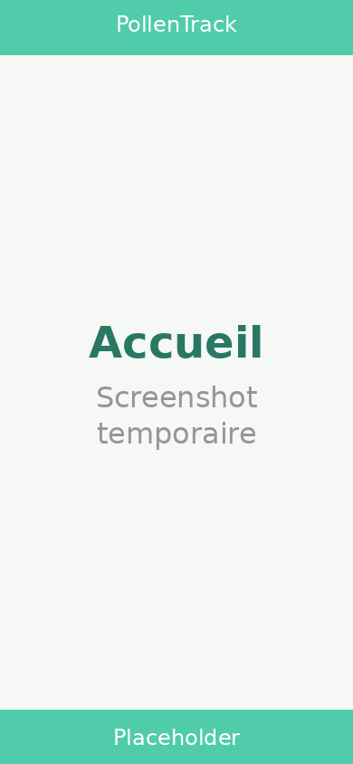
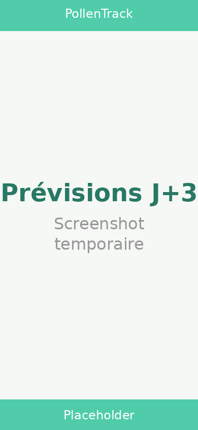
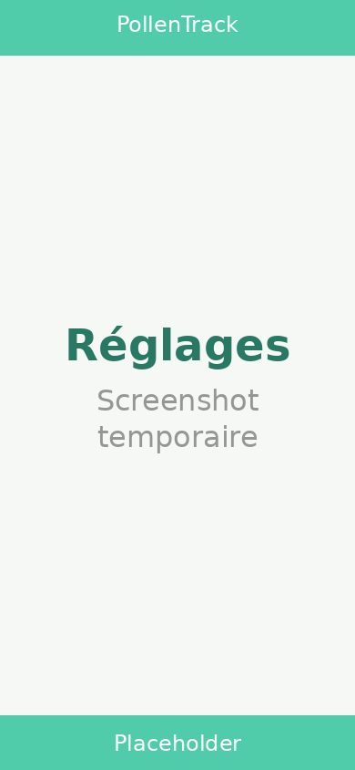

# 🌿 PollenTrack

**PollenTrack** is a French iOS app that displays real-time pollen levels and a 3-day forecast for any commune in France. It uses the [Atmo France](https://www.atmo-france.org/) open-data API to fetch pollen indices per taxon and shows health recommendations adapted to the current level.

Built with **SwiftUI** and designed for the **iOS 26 Liquid Glass** aesthetic.

---

## Screenshots

| Login | Home (today) | Forecast (J+3) | Settings |
|:-----:|:------------:|:--------------:|:--------:|
|  |  |  |  |

> **Note:** screenshots are taken on an iPhone running iOS 26 with the Liquid Glass UI.

---

## How It Works

```
┌─────────────┐        ┌──────────────────┐        ┌────────────────────┐
│  iPhone GPS  │──lon──▶│  data.gouv.fr    │──INSEE─▶│  Atmo France API   │
│  (CoreLoca.) │  lat   │  reverse-geocode │  code   │  /api/opendata/    │
└─────────────┘        └──────────────────┘        │  pollen/           │
                                                    └────────┬───────────┘
                                                             │ JSON
                                                    ┌────────▼───────────┐
                                                    │   PollenTrack App  │
                                                    │  ┌──────────────┐  │
                                                    │  │  HomeView    │  │
                                                    │  │  ForecastView│  │
                                                    │  │  SettingsView│  │
                                                    │  └──────────────┘  │
                                                    └────────────────────┘
```

1. **Location** — The app requests the device's GPS position via `CoreLocation`.
2. **Reverse geocode** — The coordinates are sent to the [French government reverse-geocoding API](https://api-adresse.data.gouv.fr/reverse/) to obtain the commune's **INSEE code**.
3. **Authentication** — The user logs in with an [Atmo France](https://admindata.atmo-france.org) account; a JWT token is returned and cached for 1 hour.
4. **Pollen data** — Using the token and the INSEE code, the app fetches today's pollen index plus a 3-day forecast from the Atmo France open-data endpoint.
5. **Display** — Results are rendered with colour-coded severity cards (0–6 scale) covering 6 taxons: Alder, Birch, Olive, Grasses, Mugwort, and Ragweed.
6. **Recommendations** — Context-aware health tips are displayed depending on the current pollen level.

### Pollen Level Scale

| Level | Label | Colour |
|:-----:|:------|:------:|
| 0 | Indisponible | ⬜ |
| 1 | Très faible | 🟩 |
| 2 | Faible | 🟢 |
| 3 | Modéré | 🟨 |
| 4 | Élevé | 🟥 |
| 5 | Très élevé | 🟣 |
| 6 | Extrêmement élevé | 🟪 |

---

## Installation on iOS 26

iOS 26 allows **direct IPA sideloading** without requiring a signing server.

### Option 1 — Download from GitHub Actions

1. Go to the **Actions** tab of this repository.
2. Open the latest successful **Build IPA** workflow run.
3. Download the `PollenTrack-<sha>` artifact (a `.zip` containing the `.ipa`).
4. Unzip and transfer the `.ipa` to your iPhone:
   - **Finder / Apple Devices (macOS):** connect your device and drag the `.ipa` onto the device panel.
   - **AltStore / SideStore:** import the `.ipa` from the Files app — no AltServer required on iOS 26.

### Option 2 — Build from source

```bash
git clone https://github.com/isoura4/PollenTrack.git
cd PollenTrack
open PollenTrack.xcodeproj
```

In Xcode:
1. Select your development team under **Signing & Capabilities**.
2. Choose your connected iPhone or a simulator.
3. Press **⌘R** to build and run.

---

## Requirements

| Component | Minimum |
|-----------|---------|
| iOS | 26.0 |
| Xcode | 26+ |
| Swift | 5.9+ |

An **Atmo France** account is required to use the app. You can [create one for free](https://admindata.atmo-france.org).

---

## Project Structure

```
PollenTrack/
├── PollenTrackApp.swift          # App entry point
├── Info.plist                    # iOS configuration & permissions
├── Models/
│   └── PollenModels.swift        # PollenLevel, PollenData, TaxonData, errors
├── Services/
│   ├── AuthStore.swift           # JWT authentication & session persistence
│   ├── AtmoService.swift         # Pollen API client (3-day forecast)
│   └── LocationService.swift     # CoreLocation + reverse geocoding
├── Views/
│   ├── ContentView.swift         # Auth router (login vs main)
│   ├── LoginView.swift           # Login screen
│   ├── MainTabView.swift         # Tab navigation (Home / Forecast / Settings)
│   ├── HomeView.swift            # Today's pollen index + recommendations
│   ├── ForecastView.swift        # 3-day forecast with taxon bar charts
│   └── SettingsView.swift        # Account, resources, legal notices
└── Extensions/
    ├── Color+Hex.swift           # Hex → SwiftUI Color initialiser
    └── GlassEffect.swift         # Liquid Glass card modifier
```

---

## Licence

Data provided under [ODbL 1.0](https://opendatacommons.org/licenses/odbl/) — Source: **Atmo France / AASQA**.